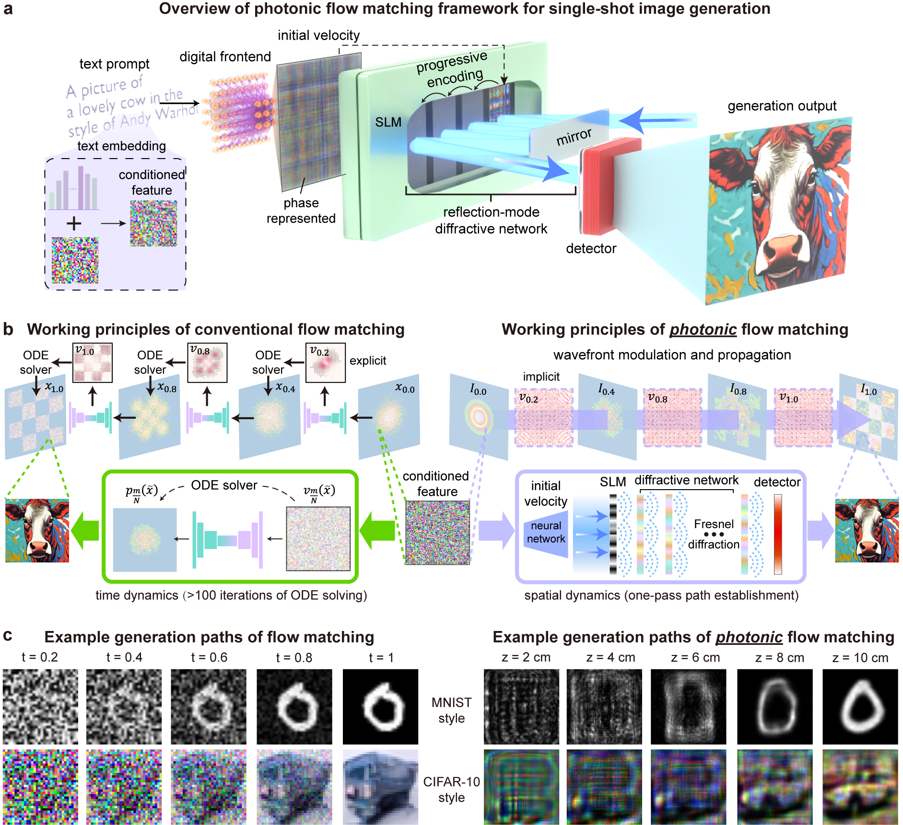

Official implementation of "Photonic Flow Matching". (Coming soon.)
<div align="center">
  

<h1>Photonic Flow Matching</h1>

**Nanxing Chen***, **Fenglei Wang***, **Shuo Wang***, **Jintian Hu*#**, **Yuxiang Sun**, **Chuang Yang**,
**Geyang Qu**, **Xuan Yu**, **Jiangyi Li**, **Jie Xhang**, **Qingbo Yang**, **Kairui Cao#**,
**Jun Guan**, **Shengjie Wang**, **Chaoran Huang**, **Yubin Fan**, **Qinghai Song#**

</div>

<div align="center">

[![Paper]
[![PDF]
[![Project]
[![License]
</div>

https://github.com/user-attachments/assets/34583132-3b91-495b-ac9e-aa05286136ec

-----

> Photonic Flow Matching (PFM) formulates image generation as a physically realizable transport process under paraxial wave optics.  
> In PFM, a sample is treated as the full normalized intensity distribution, while free-space propagation and programmable phase modulation induce a transport map on the sample space.

## Overview

This repository provides the implementation of **Photonic Flow Matching (PFM)**, a wave-optics-grounded framework for continuity-driven generative transport.

The core idea of PFM is:

- the normalized optical intensity evolves according to a continuity law;
- the transport velocity is induced by the optical phase gradient;
- free-space propagation and phase modulation together define a physically constrained generative process.

This repository includes:

- training and inference code for PFM;
- simulated optical propagation modules;
- configurable phase modulation layers;
- demo scripts for sample generation;
- evaluation scripts for common generative metrics.

---

# 🗺️ Meet Photonic Flow Matching! We've built a optoelectronic generative model for Text-to-Image! 🏗️🌍

Photonic Flow Matching has focused on:

- **Wave-optics generative law**: By transforming the time-dependent generation process into the spatial domain, generation is achieved through a single analytical propagation of light, thereby obviating the need for an ODE solver.
- **Input-dependent velocity modulation**: Revisiting diffractive neural networks from the perspective of flow matching, we designed a nonlinear network with dynamic modulation.
- **State-of-the-Art Generation**: Superior performance on diverse benchmarks compared to both existing optical-based approaches.

---

# ⚙️ Quick Start

We provide the software implementations of:

- **PFM training**
- **PFM inference / generation**
- **Simulated optical propagation**
- **Phase-mask-conditioned transport**
- **Evaluation pipeline**

## Installation

**1. Create conda environment**

```bash
conda create -n pfm python=3.10 -y
conda activate pfm
```

**2. Install PyTorch (CUDA 12.8)**

```bash
pip install torch==2.9.1 torchvision==0.24.1 --index-url https://download.pytorch.org/whl/cu128
```

> For other CUDA versions, see [PyTorch Get Started](https://pytorch.org/get-started/locally/).

**3. Install PFM**

